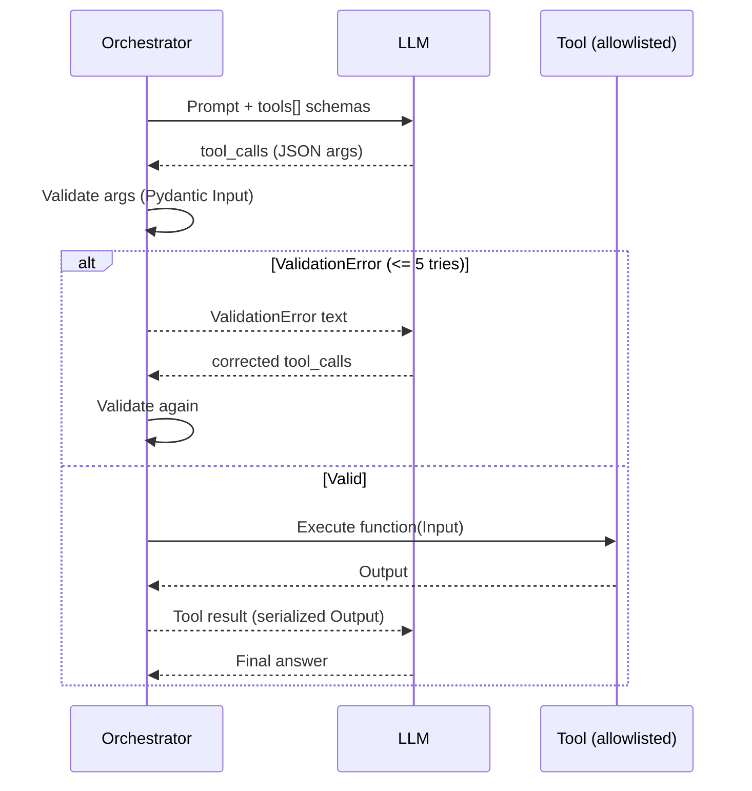

# RFC 001 — Native Tool Calling Evaluator (No Code Interpreter)

## Status
Draft (2026-04-02)

## Context / Problem Statement
Earlier design notes sometimes assumed a **code-generation + subprocess execution** pattern (the model writes Python, the harness runs it).

We are explicitly moving away from that approach because it breaks the intended **Pydantic v2 “Walled Garden”** boundary:

- **Type safety bypass**: if the model emits Python, the harness is no longer enforcing strict, typed tool inputs at the interface boundary; type errors and malformed inputs can become arbitrary runtime behavior.
- **Unbounded execution surface**: executing model-authored code expands the attack/bug surface and complicates reproducibility.
- **Non-deterministic failure modes**: exceptions become “whatever the script does” instead of a predictable `ValidationError` at the schema boundary.

This repo’s benchmark philosophy is to keep all execution inside an allowlisted tool surface and use strict schemas for tool I/O.

## Decision
The evaluator/orchestrator MUST use **Native Tool Calling**:

- The model returns **tool calls** (structured arguments), not source code.
- The orchestrator validates tool arguments locally using **Pydantic v2 strict models**.
- Only allowlisted tool functions (exported in `tools.ACTIVE_TOOLS`) are executed.

## 2) Execution Pipeline (Critical)
This is the canonical control loop for tool-enabled evaluation runs.

1) **Tool surface construction**
   - Orchestrator imports `tools.ACTIVE_TOOLS` (currently 35 functions).
   - For each tool, orchestrator derives an OpenAI-style tool schema from the tool’s Pydantic `Input` model (JSON Schema).

2) **LLM call with tools**
   - Orchestrator calls the LLM with:
     - the task prompt (benchmark scenario + instructions), and
     - `tools=[...]` containing the full allowlisted tool schema set.

3) **Model response**
   - The model responds with either:
     - one or more `tool_calls` (each includes a tool name and JSON arguments), or
     - a final natural-language answer (when no tool call is needed/allowed by mode).

4) **Local validation (schema boundary)**
   - For each tool call, orchestrator parses the JSON arguments into the tool’s Pydantic `Input` model with strict validation.
   - If parsing fails, Pydantic raises `ValidationError`.

5) **Self-correction loop on validation failures**
   - When a `ValidationError` occurs:
     - Orchestrator returns the error text to the model as a normal assistant-visible message.
     - The model must correct the tool call arguments and try again.
   - Maximum attempts for this validation-retry loop: **5 iterations**.
   - After the limit, the run is recorded as a failure with preserved raw outputs and error details.

6) **Tool execution and result return**
   - If arguments are valid, orchestrator executes the allowlisted Python function locally.
   - Orchestrator returns the tool result (serialized from the tool’s Pydantic `Output`) to the model.
   - The model then produces the final answer.

### Error taxonomy (required behavior)
- `ValidationError` (Pydantic): indicates malformed/mistyped tool arguments.
  - Participates in the **max-5** retry loop.
  - Returned to the model to enable payload correction.
- `ValueError` (tool runtime): indicates a domain-level constraint violation (e.g., missing required business fields, negative demand, etc.).
  - Returned to the model as a tool failure message.
  - May be retried if the model can correct inputs, but this RFC only mandates the strict retry limit for `ValidationError`.

## Security and reproducibility properties
- **No arbitrary code execution**: the model cannot expand the execution surface by emitting Python.
- **Deterministic tool surface**: only `tools.ACTIVE_TOOLS` is executed; the tool set is versioned.
- **Typed boundary**: tool inputs/outputs remain strictly validated at the orchestrator boundary (Pydantic v2 strict mode).
- **Observable failure modes**: malformed calls fail predictably at validation time, improving debugging and scoring.

## Non-goals
- Vector-search tool retrieval (Qdrant) or ranking-based DTR.
- Dynamic tool expansion at runtime.
- Strict run-dropping for minor formatting issues in model text output.

## Mermaid sequence diagram

